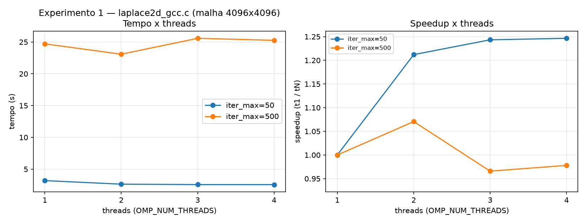
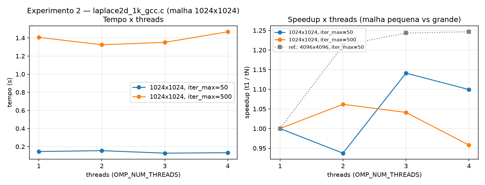
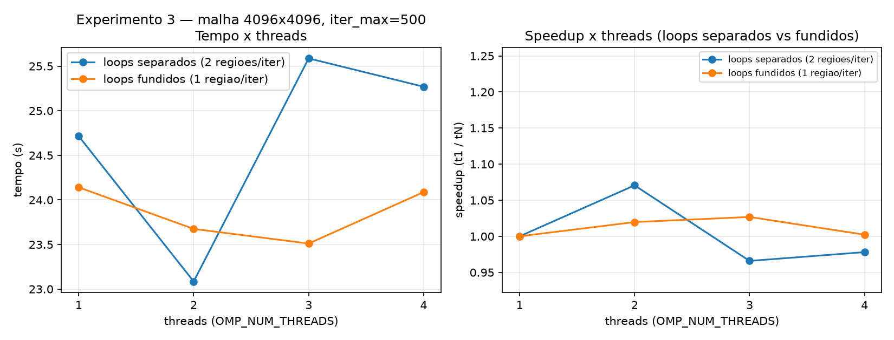
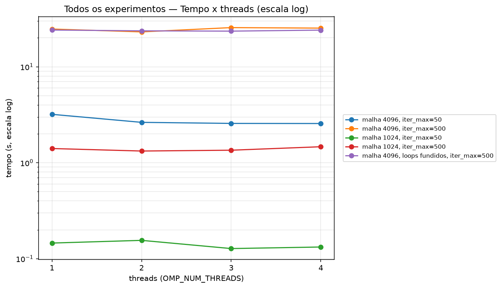

# Apresentação — Tarefa 2: Laplace 2D (Jacobi)

## Arquivos

- `laplace2d_gcc.c` — malha 4096×4096, `while` só por `iter_max`.
- `laplace2d_1k_gcc.c` — igual à anterior, malha reduzida para 1024×1024.
- `laplace2d_1loop_gcc.c` — funde os dois forks de cada iteração (cálculo + cópia) em um único fork com dois `#pragma omp for` dentro — um fork/join em vez de dois.
- `timer.h` — header com cronômetro do exemplo.
- `bench.sh [threads] [repetições] [csv]` 

Nos três `.c` o cálculo de erro (`error = fmax(...)`) está **comentado**:
`error` é `shared` e seria atualizada por várias threads sem
`reduction`/`atomic` — uma condição de corrida.

## Como as diretivas impactam o desempenho

- Cada iteração do Jacobi abre regiões paralelas (`parallel for`) que fazem *fork/join* de threads — esse overhead é fixo por chamada, não diminui com o tamanho do problema.

- **Fundir os dois loops (experimento 3) reduz o tempo total e a variância**, mesmo sem mudar o coeficiente angular da curva de speedup — metade dos fork/join significa metade da exposição a ruído de agendamento do SO.

## Speedup esperado vs. observado

 (iter_max 50 vs 500): esperado = curva igual. Observado = **500 ficou mais achatado** (1,07×/0,97×/0,98× vs 1,21-1,25×). ❌

 (mesma malha, iter_max 50 vs 500): esperado = curva igual. Observado = **igual, sim** — mas porque overhead já domina em qualquer `iter_max`, não pelo motivo alegado. ✅
(malha 1024 vs 4096): esperado = malha menor → speedup maior. Observado = **speedup pior** (≤1,14×, quase sempre ≤1×). ❌

 esperado = fusão aumenta speedup. Observado = speedup relativo **quase igual**⚠️ parcial

 tempo de todos os experimentos, escala log (a malha 1024 é ~20x mais rapida que a 4096 em qualquer iter_max)

|          Experimento             |    Speedup máximo observado    |
|----------------------------------|--------------------------------|
| 1 — malha 4096, iter_max=50      | 1,25× (4 threads)               |
| 1 — malha 4096, iter_max=500     | 1,07× (2 threads; cai p/ ~0,97-0,98× em 3-4) |
| 2 — malha 1024,                  | 1,14× (quase sempre ≤ 1×)      |
| 3 — loops fundidos vs. separados | ~1,0-1,03×       (melhor tempo)|

- **Malha menor (experimento 2) piora o speedup**, ao contrário do esperado: reduzir a malha tira o gargalo de memória, mas também reduz o trabalho por região paralela — o overhead fixo de fork/join passa a dominar.
- **`iter_max` maior MUDA a curva de speedup, sim** (corrigido após rodar 10 repetições em vez de 3): `iter_max=500` fica mais achatada/perto de 1× que `iter_max=50`, provavelmente porque mais iterações repetem mais vezes o fork/join, dando mais chance de ruído de agendamento do SO dominar o tempo total.


## Como rodar

```bash
./compilar.sh              # gera todos os binários (um por combinação arquivo x iter_max)
./bench.sh 4 3              # max_threads=4, 3 repetições -- roda 1..4 threads, grava CSV
# iter_max=500 (laplace2d_gcc_i500) precisou de 10 repeticoes p/ diluir outliers de SO -- ver resultados.md
python3 plot.py              # gera os 3 graficos por experimento + 1 combinado, a partir do CSV
```
