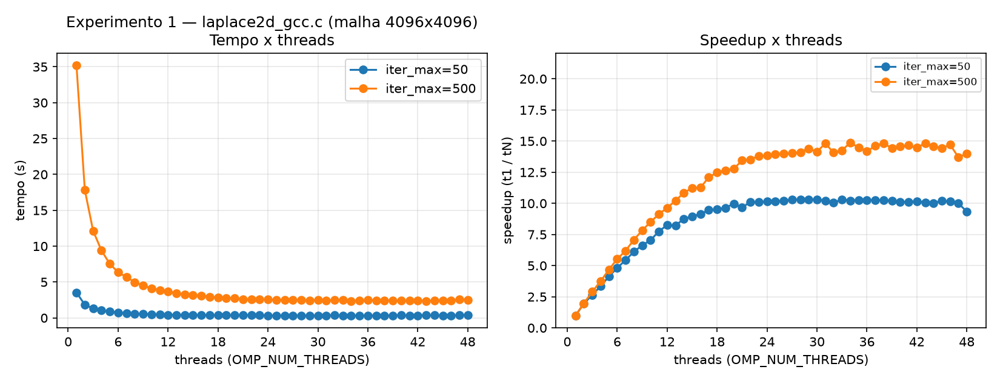
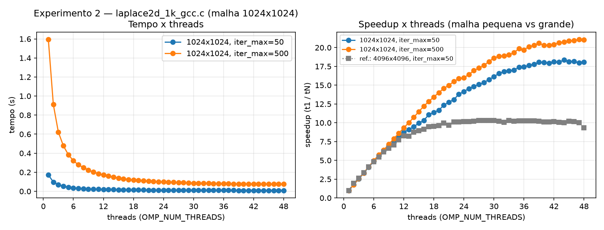
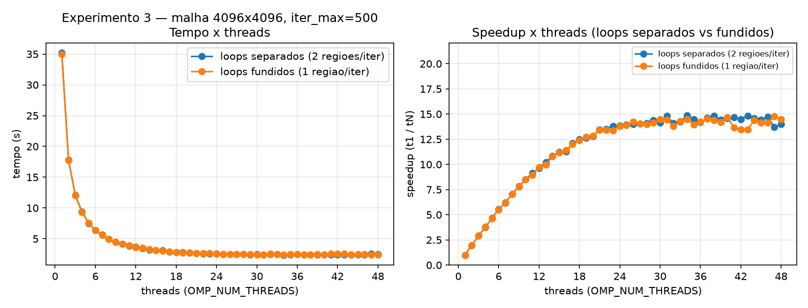
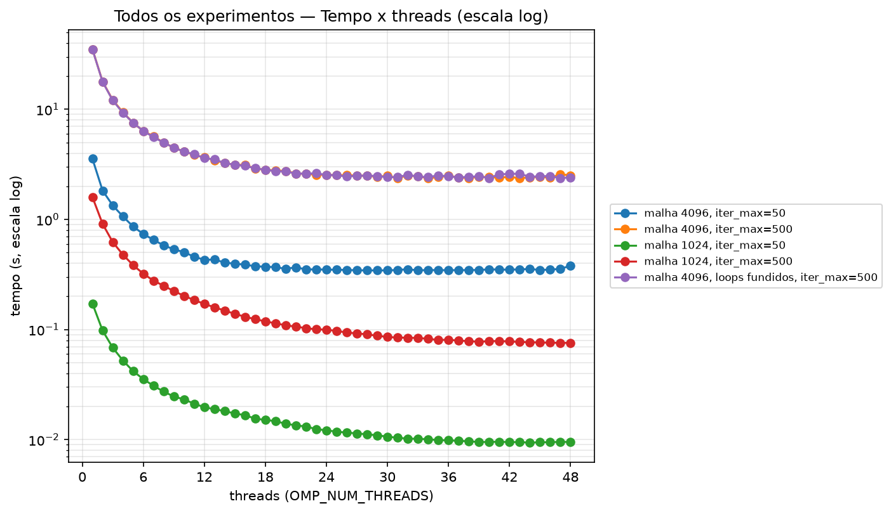

# Apresentação — Tarefa 2: Laplace 2D (Jacobi) no Santos Dumont

Mesmo código do `APRESENTACAO.md` (notebook), rodado no cluster Santos
Dumont: **Intel(R) Xeon(R) Gold 6252 @ 2,10GHz, 48 núcleos físicos**
(2 soquetes × 24 núcleos), fila `sequana_cpu_dev`, nó **exclusivo**
(`--exclusive`, sem outros jobs disputando CPU). 5 repetições
(`iter_max=50`) / 3 repetições (`iter_max=500`), threads de 1 a 48.

## Speedup esperado vs. observado (e vs. o que deu no notebook)

- **Exp. 1** (malha 4096, iter_max 50 vs 500): esperado = curva igual.
  Observado = **500 tem speedup MAIOR** (~14-15×) que 50 (~10×). ❌ — e na
  direção **oposta** ao notebook (lá o ruído fazia 500 parecer pior).
- **Exp. 2** (malha 1024 vs 4096): esperado = malha menor → speedup maior.
  Observado = **sim, dessa vez bateu**: malha 1024 chega a 18-21×, contra
  ~10× da malha 4096. ❌ no notebook (malha pequena piorava), ✅ aqui.
- **Exp. 2** (mesma malha 1024, iter_max 50 vs 500): esperado = curva
  igual. Observado = **não é igual** — 500 (~21×) escala mais que 50
  (~18×), mesmo padrão do Exp. 1. ❌
- **Exp. 3** (loops separados vs. fundidos): esperado = fusão aumenta
  speedup. Observado = curvas **praticamente idênticas** — a fusão que
  ajudava no notebook aqui não faz diferença perceptível. ⚠️ neutro

## Por que os resultados do cluster contradizem os do notebook

- **Sem ruído de SO**: nó exclusivo → curvas lisas, sem os *outliers* de
  26-36s que a gente via no notebook (4 núcleos, sem isolamento de
  processos). Isso por si só já muda a leitura de vários experimentos.
- **`iter_max` maior agora ajuda, não atrapalha**: com 48 threads reais
  disponíveis, mais iterações dão mais chance de amortizar custo fixo
  (setup, primeira iteração mais lenta por *cache warm-up*) — no notebook
  isso era mascarado pelo ruído.
- **Malha pequena escala melhor com muitos núcleos**: 1024×1024 cabe bem
  melhor no cache agregado de 48 threads que 4096×4096 — o gargalo de
  banda de memória que limitava o notebook em 2 threads só aparece aqui
  perto de 20-24 threads (quando cruza para o segundo soquete/NUMA).
- **Fusão de loops vira irrelevante em grande escala**: o overhead de
  fork/join que a fusão eliminava é fixo por chamada; com 48 threads e
  malha grande, o trabalho por iteração já é grande o bastante pra esse
  overhead ser desprezível na conta total.

## Resultados









| Experimento | Speedup máximo observado |
|---|---|
| 1 — malha 4096, iter_max=50 | 10,3× (29 threads) |
| 1 — malha 4096, iter_max=500 | 14,9× (34 threads) |
| 2 — malha 1024, iter_max=50 | 18,4× (44 threads) |
| 2 — malha 1024, iter_max=500 | 21,1× (47 threads) |
| 3 — loops separados (=exp.1, iter_max=500) | 14,9× (34 threads) |
| 3 — loops fundidos | 14,8× (47 threads) — praticamente igual ao separado |

Todas as curvas de speedup sobem de forma consistente até ~18-24 threads e
depois entram num platô (ganho marginal decrescente); o Exp. 1 com
`iter_max=50` chega a **cair** em 48 threads (10,3× → 9,3×) — hipótese:
com só 50 iterações e malha grande, o custo fixo de atravessar os 2
soquetes (NUMA) nos últimos núcleos pesa mais que o trabalho ganho.

## Como reproduzir

```bash
# no SDumont, dentro de 02_laplace2d/ (fila sequana_cpu_dev, limite de 20 min)
bash compilar.sh
sbatch run_sdumont_fast.sh   # laplace2d_gcc_i50, 1k_gcc_i50, 1k_gcc_i500 -- ~15 min
sbatch run_sdumont_slow1.sh  # laplace2d_gcc_i500 -- ~15 min (so depois do job anterior terminar)
sbatch run_sdumont_slow2.sh  # laplace2d_1loop_gcc_i500 -- ~15 min (so depois do slow1 terminar)

# de volta no notebook, junta os 3 CSVs e plota
python3 plot.py resultados_sdumont_full.csv _sdumont
```
