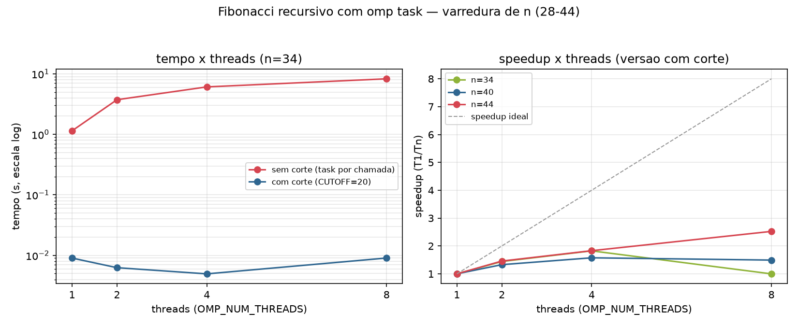
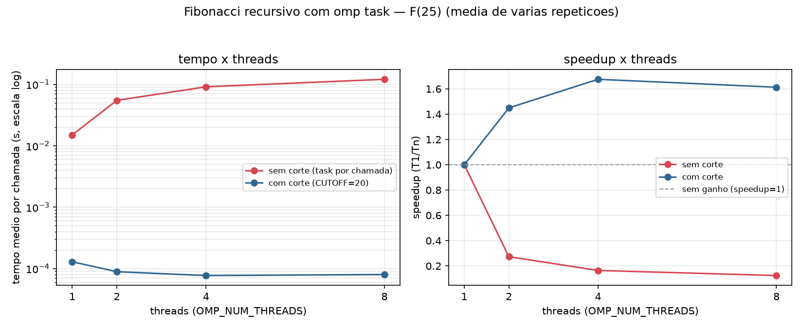

# Apresentação — Tarefa 3: Fibonacci com `omp task` (versão inicial, varredura de n)

## Arquivos

- `fib_task.c` — `fib(n)` recursivo; cada chamada cria duas `#pragma omp task shared(i/j)` (uma para `fib(n-1)`, outra para `fib(n-2)`) e sincroniza com `#pragma omp taskwait`. 
- `fib_task_cutoff.c` — mesmo algoritmo, mas abaixo de `CUTOFF=20` resolve sequencialmente 
- `bench_sweep.sh` — varreduras em N e em threads pra gerar tabelas e graficos

## Como as diretivas impactam o desempenho

- O `shared` é necessário: sem ele, `i`/`j` seriam privadas à task e o resultado sairia errado.
- Cada `omp task` tem custo de criação/agendamento; numa recursão como Fibonacci, o número de tasks explode exponencialmente com `n`.
- Sem corte de granularidade, a maioria das tasks é trivial (`n<2`) — o overhead de criar a task supera o trabalho que ela faz.
- Um `CUTOFF` que resolve casos pequenos sequencialmente elimina exatamente essas tasks inúteis, mantendo tasks só onde há trabalho suficiente para compensar o overhead.

## Resultados



| Threads | fib(34) sem corte | fib(34) com corte | fib(40) com corte | fib(44) com corte |
|---|---|---|---|---|
| 1 | 1,14 s | 9,0 ms | 167 ms | 1,18 s |
| 8 | 8,27 s | 9,0 ms | 112 ms | 0,47 s |

- **Sem corte, mais threads pioram o tempo** (de 1,14 s para 8,27 s em `n=34` — quase 8× mais lento com 8 threads) — cada chamada trivial vira uma task, e o overhead de agendar todas domina.
- **Com corte**, o ganho aparece de verdade só quando `n` é grande o suficiente para gerar tasks acima do corte em número suficiente: speedup de até ~2,5× em `n=44` com 8 threads, mas quase nenhum ganho em `n=34` (poucas tasks acima do corte para ocupar 8 threads).
- Conclusão: paralelismo por tarefas exige granularidade mínima por task — tasks pequenas demais pioram o desempenho em vez de melhorar, e o ganho real de threads escala junto com o tamanho do problema.

## Resultados



| Threads | fib(25) sem corte | fib(25) com corte |
|---|---|---|
| 1 | 15,0 ms | 0,13 ms |
| 8 | 120,8 ms | 0,08 ms |


## Como rodar

```bash
./compilar.sh                       # gera ./fib_task e ./fib_task_cutoff
./bench_sweep.sh > resultados_sweep_baseline.csv        # n=28..36, sem corte
./bench_sweep_cutoff.sh > resultados_sweep_cutoff.csv   # n=28..44, com corte
python3 plot.py                     # gera fibonacci_sweep.png (e fibonacci_f25.png)
```
