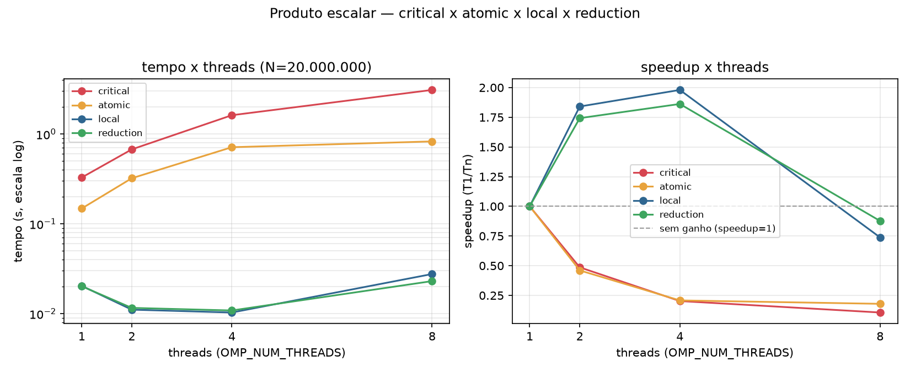

# Apresentação — Tarefa 4a: produto escalar e sincronização

## Arquivos

- `exemplo_escalar_critical.c` — soma os produtos parciais em `dot` dentro de `#pragma omp critical`, a cada iteração do laço.
- `exemplo_escalar_atomic.c` — mesma ideia, mas com `#pragma omp atomic` (trava só a operação, não um bloco).
- `exemplo_escalar_local.c` — cada thread acumula em uma variável privada (`aux_dot`) durante o laço, e só entra em `critical` **uma vez**, no final, para somar em `dot`.
- `exemplo_escalar_reduction.c` — usa `#pragma omp for reduction(+:dot)`: o compilador faz automaticamente o que a versão `local` faz manualmente.
- `compilar.sh` — compila as 4 versões com `-fopenmp -O2`.
- `bench.sh` — repete `run.sh` para `OMP_NUM_THREADS` = 1, 2, 4, 8 e imprime os tempos em CSV.
- `plot.py` — lê `resultados.csv` e gera `grafico_escalar.png` (tempo e speedup × threads).

## Como as diretivas impactam o desempenho

- `critical` protegido a cada iteração vira um gargalo: todas as threads disputam o mesmo lock a cada soma.
- `atomic` protege só a instrução aritmética (não um bloco de código) — bem mais leve que `critical`, mas ainda paga sincronização a cada iteração.
- Acumular em variável privada e só sincronizar uma vez no final elimina quase toda a disputa — o custo de sincronização deixa de crescer com o tamanho do vetor.
- `reduction` entrega o mesmo ganho da técnica manual (variável privada + merge único), com código mais simples.

## Resultados (N = 20.000.000, média de 3 execuções)



| Threads | critical | atomic | acumulador local | reduction |
|---------|----------|--------|------------------|-----------|
| 1       | 0.328    | 0.148  | 0.020            | 0.020     |
| 2       | 0.675    | 0.322  | 0.011            | 0.012     |
| 4       | 1.621    | 0.713  | 0.010            | 0.011     |
| 8       | 3.097    | 0.828  | 0.028            | 0.023     |

- `critical` **piora** conforme aumentam as threads (0,33s → 3,10s de 1 para 8) — mais threads disputando o mesmo lock a cada iteração.
- `atomic` segue a mesma tendência de piora, mas de forma bem mais suave (0,15s → 0,83s) — trava só a instrução, não um bloco.
- `local` e `reduction` **melhoram até 4 threads** (speedup ≈ 2×, uso real dos núcleos físicos) e voltam a piorar em 8 (acima de 4 threads é só hyperthreading, sem núcleo físico extra) — dá pra ver os dois pontos de virada exatos no gráfico de speedup.
- Ordem de desempenho observada em qualquer número de threads: `critical` (pior) → `atomic` → `local` ≈ `reduction` (melhores).

## Como rodar

```bash
./compilar.sh          # gera as 4 versões (critical/atomic/local/reduction)
./bench.sh 20000000 > resultados.csv   # N=20.000.000, roda 1/2/4/8 threads
python3 plot.py         # gera grafico_escalar.png a partir do resultados.csv
```
