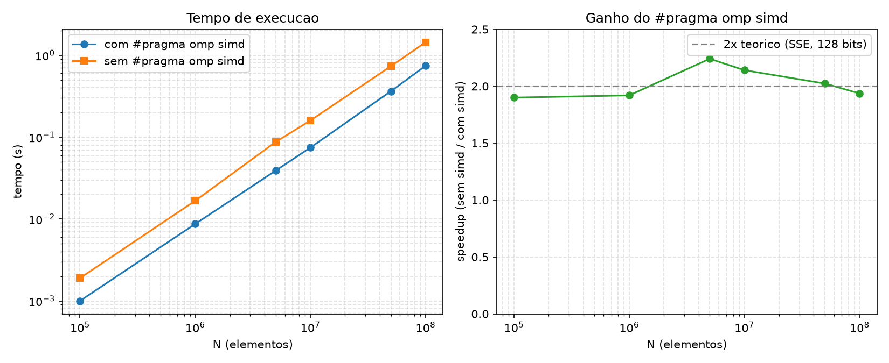

# Resultados — Tarefa 5 (`#pragma omp simd` em laço em faixas)

Máquina: Intel i5-1135G7 (SSE, vetor de 128 bits = 2 `double` por instrução),
`OMP_NUM_THREADS=4`. Tempo em segundos (`omp_get_wtime`), média de 3 execuções.

`DoSomeWork` foi implementado como uma recorrência simples repetida 50 vezes
por elemento (`x = x*0.99 + 1.0`), para que o teste meça poder de
processamento — onde o SIMD atua — em vez de ficar limitado pela banda de
memória (com um cálculo trivial por elemento, ambas as versões ficam
igualmente presas à leitura/escrita do vetor e a diferença desaparece).

Também foi necessário compilar com `-fno-tree-vectorize -fno-tree-slp-vectorize`:
a partir do GCC 12, o próprio `-O2` já vetoriza laços simples sozinho, então
sem essas flags as duas versões saíam vetorizadas e ficavam com tempos
praticamente iguais — a comparação só isola o efeito do `#pragma omp simd`
quando a vetorização automática do compilador é desligada.

| N (elementos) | com simd (s) | sem simd (s) | speedup (sem/com) |
|---------------|--------------|--------------|--------------------|
| 100.000       | 0.0010       | 0.0019       | 1.88x              |
| 1.000.000     | 0.0087       | 0.0167       | 1.91x              |
| 5.000.000     | 0.0390       | 0.0874       | 2.24x              |
| 10.000.000    | 0.0745       | 0.1595       | 2.14x              |
| 50.000.000    | 0.3634       | 0.7353       | 2.02x              |
| 100.000.000   | 0.7440       | 1.4404       | 1.94x              |



## Interpretação

- Em **todos** os tamanhos testados a versão com `#pragma omp simd` foi mais
  rápida — não foi observado nenhum aumento de tempo causado pela diretiva.
- O speedup fica bem estável em torno de **2x**, o que bate exatamente com o
  hardware: vetores SSE de 128 bits processam 2 `double` por instrução, então
  dobrar o paralelismo de dados dobra a taxa de processamento — o ganho
  teórico máximo aqui é 2x, e é isso que se observa.
- A diretiva não tem custo por si só: ela apenas informa ao compilador que as
  iterações do laço interno (dentro de cada faixa de `STRIP_SIZE`) são
  independentes, permitindo emitir instruções vetoriais. Quando o laço já é
  vetorizável (como aqui, sem dependências entre iterações), não há motivo
  para a diretiva piorar o desempenho.
- O ganho poderia não aparecer, ou a diretiva poderia até atrapalhar, em
  situações que fogem deste caso: laços com dependências entre iterações
  (forçando o compilador a serializar ou gerar código de verificação extra),
  laços muito curtos (onde o overhead do `remainder loop` e do setup vetorial
  supera o trabalho útil) ou laços já limitados pela banda de memória, como
  visto no primeiro teste feito para este experimento.

## Como reproduzir

```bash
wsl -d Ubuntu
cd "/mnt/c/Users/HugoV/Desktop/GB100 Processamento Paralelo/Laboratorio_2/05_simd"
./compilar.sh
./bench.sh 4
python3 plot.py   # gera curva_desempenho.png a partir dos dados acima
```
