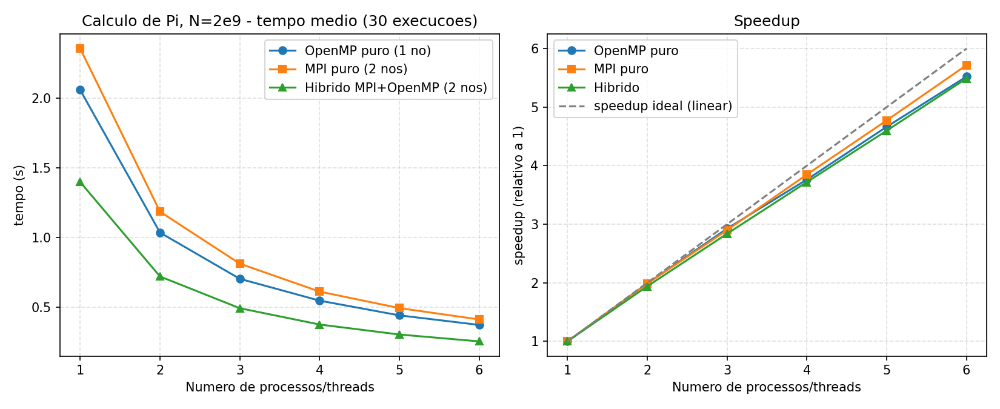

# Apresentação — Tarefa 8: Cálculo de Pi (OpenMP puro vs. MPI puro vs. Híbrido)

Resultados de execução real no SDumont (jobs 11589434, 11589435, 11589463),
`N = 2.000.000.000`, média de 30 execuções independentes por configuração.

## Arquivos

- `pi_openmp.c` / `pi_mpi.c` / `pi_hybrid.c` — as 3 implementações 
- `bench_openmp.sh` / `bench_mpi.sh` / `bench_hybrid.sh` — jobs `sbatch` que
  rodaram a varredura 1..6 × 30 repetições.
- `submeter_todos.sh` — driver que submeteu os 3 jobs em sequência (a fila
  `sequana_cpu_dev` permite só 1 job por vez por usuário).
- `resultados_openmp.csv`, `resultados_mpi.csv`, `resultados_hibrido.csv` —
  as 540 execuções brutas (3 × 6 configs × 30 reps).
- `plot.py` → `curva_pi.png` — gráfico gerado a partir dos 3 CSVs acima.

## O que cada eixo "1..6" significa (importante para interpretar o gráfico)

As 3 curvas **não** representam o mesmo número de "trabalhadores" para um
mesmo valor de `k` no eixo x:

| Config     | Nós usados | `k` no eixo x       | Trabalhadores totais em `k` |
|------------|:----------:|----------------------|:-----------------------------:|
| OpenMP puro| 1          | threads              | `k`                            |
| MPI puro   | até 2      | processos            | `k`                            |
| Híbrido    | 2 (fixo)   | threads por processo | `2·k`                          |

Ou seja, em `k=6` o híbrido está de fato usando **12** unidades de execução
(2 processos × 6 threads), contra 6 no OpenMP puro e 6 no MPI puro. Isso
importa para a leitura dos resultados abaixo.

## Resultados

Tempo médio (s), 30 execuções por ponto:

| k | OpenMP puro (1 nó) | MPI puro (2 nós) | Híbrido (2 nós, 2 proc.) |
|---|---------------------|--------------------|----------------------------|
| 1 | 2.0606              | 2.3578             | 1.3994                     |
| 2 | 1.0364              | 1.1865             | 0.7212                     |
| 3 | 0.7043              | 0.8132             | 0.4932                     |
| 4 | 0.5476              | 0.6126             | 0.3762                     |
| 5 | 0.4418              | 0.4940             | 0.3043                     |
| 6 | 0.3732              | 0.4125             | 0.2549                     |

Speedup relativo a `k=1` da própria série:

| k | OpenMP puro | MPI puro | Híbrido |
|---|:-----------:|:--------:|:-------:|
| 1 | 1.00        | 1.00     | 1.00    |
| 2 | 1.99        | 1.99     | 1.94    |
| 3 | 2.93        | 2.90     | 2.84    |
| 4 | 3.76        | 3.85     | 3.72    |
| 5 | 4.66        | 4.77     | 4.60    |
| 6 | 5.52        | 5.72     | 5.49    |



O valor de Pi calculado é correto em todas as 540 execuções (`3.14159265...`,
divergindo só a partir da 8ª–9ª casa decimal entre configurações diferentes —
efeito esperado de ponto flutuante não-associativo ao somar os mesmos termos
em ordens diferentes, não um bug).

## Interpretação

- **Speedup quase linear nas 3 abordagens** até 6 processos/threads (entre
  5.5× e 5.7× em `k=6`, perto do ideal 6×) — o problema é embaraçosamente
  paralelo (cada termo da soma é independente) e `N` é grande o bastante
  (2×10⁹) para que o overhead de sincronização (`reduction` no OpenMP,
  `MPI_Bcast`/`MPI_Reduce` no MPI) seja irrelevante perto do tempo de
  cálculo.

- **OpenMP puro é a configuração mais eficiente por trabalhador**: em
  qualquer `k`, OpenMP puro (1 nó, só threads) é mais rápido que MPI puro
  com o mesmo `k` processos (2 nós). Sem comunicação entre nós nem
  `MPI_Bcast`/`MPI_Reduce` de rede, o único custo é o fork-join interno das
  threads — mais barato que passar mensagens MPI mesmo que pequenas.

- **Híbrido tem o menor tempo absoluto, mas não é comparação justa 1:1**:
  em `k=6` o híbrido roda em 0.2549 s contra 0.3732 s do OpenMP puro — só
  que o híbrido está usando 12 trabalhadores (2 processos × 6 threads) contra
  6 do OpenMP puro. Comparando de forma justa, por **trabalhador total**:
  - Híbrido com 6 trabalhadores totais (2 processos × 3 threads) = **0.4932 s**
  - MPI puro com 6 trabalhadores (6 processos) = **0.4125 s**
  - OpenMP puro com 6 trabalhadores (6 threads, 1 nó) = **0.3732 s**

  Ou seja, para o **mesmo total de 6 trabalhadores**, a ordem observada é
  OpenMP puro < MPI puro < Híbrido — o híbrido é o *mais lento* dos três
  nessa comparação normalizada, apesar de ter o menor tempo absoluto na
  tabela bruta. Isso sugere que, para este problema (soma embaraçosamente
  paralela, sem troca de dados entre iterações), dividir o mesmo total de
  trabalhadores em "menos processos com mais threads" custa mais do que
  usar processos MPI puros ou threads OpenMP puras — possivelmente por
  afinidade de CPU: o Slurm distribui `--cpus-per-task` de forma mais
  previsível entre *tasks* MPI do que o runtime OpenMP entre *threads*
  dentro de uma mesma task, o que pode gerar migração de threads entre
  núcleos no híbrido.

- **MPI puro perde para OpenMP puro mesmo em `k=1`** (2.3578 s vs. 2.0606 s,
  ambos com 1 único trabalhador): mesmo sem paralelismo real, o processo
  MPI paga o custo fixo de `MPI_Init`/`MPI_Finalize`/`MPI_Bcast` — cerca de
  **0.30 s** de overhead absoluto que não existe na versão OpenMP puro.

- **A mesma topologia MPI (2 processos, 1 por nó) fica mais lenta só por
  linkar OpenMP**: MPI puro com `k=2` (1.1865 s) e híbrido com `k=1`
  (1.3994 s, 1 thread por processo) usam exatamente a mesma configuração
  MPI — 2 processos, um em cada nó — e deveriam ter o mesmo custo, já que 1
  thread não paraleliza nada. Mesmo assim, o híbrido é **18% mais lento**.
  A única diferença entre os binários é que `pi_hybrid.c` foi compilado com `-qopenmp` e entra
  numa região `#pragma omp parallel for` (mesmo que com 1 thread só) — o
  custo extra vem de inicializar o runtime OpenMP (`libgomp`/`libiomp5`) em
  cima da já inicializada `MPI_Init`, não de computação real.

## Como reproduzir

```bash
# No SDumont:
cd 08_pi_MPI
bash compilar.sh
bash submeter_todos.sh   # roda os 3 sbatch em sequência (respeita o limite de fila)
python3 plot.py          # gera curva_pi.png a partir dos 3 CSVs
```
